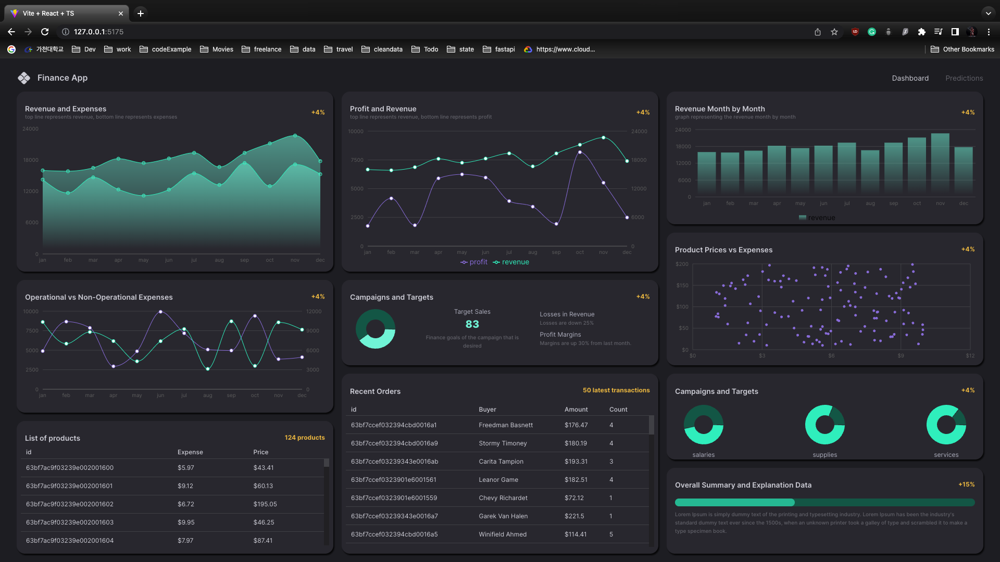

## Finance Dashboard

Building a MERN(Mongo, Express, React and Node) Machine Learning AI-Finance Application.
Install packages and then star the project:`npm install && npm run dev`.

#### Deployment
Change directory to server and follow the instructions below:
###### Install flyctl on Mac OS
brew install flyctl

##### Login on your account
flyctl auth login

##### Deploy to the world
fly launch --now then fly deploy --local-only

 This work is licensed under a <a rel="license" href="http://creativecommons.org/licenses/by/4.0/">Creative Commons Attribution 4.0 International License</a>.
